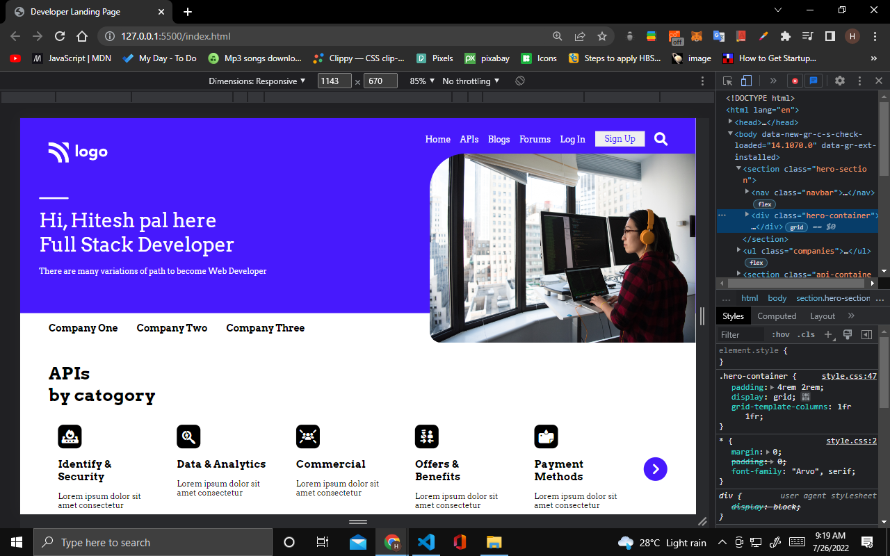
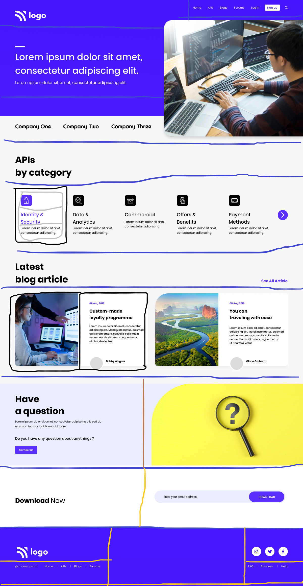

# Project 9 Developer Landing Page

## Hey there, I am Hitesh Pal

I have build this template website with my core HTML CSS skills

You can check out here: [Developer Landing Page By Hitesh](https://hitesh-developer-landing-page.netlify.app/)

## What i have learned from this project

    - In this project I have learned how to use HTML and css to build templates.
    - How to approach the project while building this big page.
    - How to use flex-box, grid  and media Queries.
    - How to align all elements in proper and responsive way.

## My Approach

## This project took me around 6 hours approximately.

### Connect with me 
[Twitter](https://twitter.com/HiteshP25522550) 
[Linkdin](https://www.linkedin.com/in/hitesh-pal-8379011ab/)
